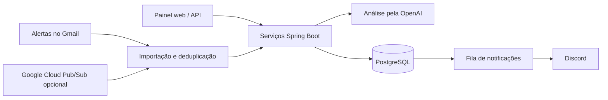

# VagaRadar AI

Aplicação de uso pessoal em Java 21 e Spring Boot para organizar vagas de tecnologia, analisar a compatibilidade com um perfil profissional por IA e enviar alertas ao Discord.

O projeto reúne integração com APIs externas, autenticação, persistência, processamento em segundo plano e um painel
web em HTML, CSS e JavaScript. O objetivo é reduzir o trabalho de leitura e triagem de alertas de emprego.

## Funcionalidades

- Cadastro manual e importação de vagas dos alertas do LinkedIn recebidos no Gmail, com prevenção de duplicidades.
- Análise de compatibilidade de 0 a 100 pela OpenAI, usando um perfil profissional personalizável.
- Extração de senioridade, requisitos, tecnologias e habilidades quando há evidências na descrição da vaga.
- Painel com paginação, busca e filtros por modelo de trabalho, status, avaliação pessoal e nota mínima.
- Triagem pessoal com **Gostei**, **Não gostei**, motivos de rejeição e histórico de vagas descartadas.
- Notificações no Discord por uma fila persistida no banco, com novas tentativas em caso de falha.
- Importação manual, agendamento configurável e suporte opcional a notificações Gmail Push via Google Cloud Pub/Sub.

## Arquitetura



O backend separa controllers, serviços, repositórios, DTOs e clientes de integração. Spring Security protege o acesso;
Spring Data JPA cuida da persistência e Flyway aplica as migrações. Docker Compose reúne aplicação e PostgreSQL.
O workflow do GitHub Actions executa os testes antes da implantação na AWS.

## Escopo e demonstração

Este é um projeto pessoal de portfólio, com acesso administrativo e integrações configuradas pelo responsável pela
instalação. Não oferece cadastro público nem isolamento de dados entre múltiplos usuários. A pontuação da IA auxilia
a triagem e depende da qualidade das informações recebidas; a decisão de candidatura continua com o usuário.

A execução local permite conhecer o projeto independentemente da disponibilidade de uma hospedagem. As integrações
são configuráveis: Gmail exige autorização Google, Discord é opcional e a análise por IA requer chave e créditos
próprios. O servidor de uso pessoal não é uma demonstração aberta ao público.

## Pré-requisitos

- Java 21
- Maven 3.9+
- PostgreSQL 16+
- Uma chave da OpenAI para usar a análise por IA

Para executar tudo em containers, use Docker Engine com Docker Compose; o build da aplicação ocorre na imagem.

## Configuração

Copie `.env.example` para `.env.local` e preencha os valores necessários. O `.env.local` é carregado localmente e não é versionado.

Além das integrações, defina `APP_ADMIN_USERNAME` e `APP_ADMIN_PASSWORD`. A senha deve ter pelo menos 12 caracteres,
ficar somente no ambiente local ou no gerenciador de segredos da plataforma e nunca ser incluída no Git.

## Executar localmente

```bash
mvn spring-boot:run
```

As migrações do banco são executadas automaticamente pelo Flyway.

Depois de iniciar, abra `http://localhost:8080/` para acessar o painel. A ação **Buscar e analisar agora** pode consumir
créditos da OpenAI; por isso, ela sempre exige uma confirmação no navegador.

## Acesso e segurança

O painel e as APIs de vagas e perfil exigem uma sessão autenticada. O login administrativo fica em
`http://localhost:8080/login`. A aplicação protege as ações de escrita da sessão com CSRF e mantém a sessão por
8 horas, por padrão.

Login, arquivos estáticos, rotas de autorização OAuth e `GET /actuator/health` permitem acesso sem sessão.
Quando habilitado, `POST /api/gmail/push` também dispensa sessão e CSRF, mas exige um JWT OIDC do Pub/Sub,
validado pelo serviço de autenticação da integração.

Após entrar no painel, use **Conectar Gmail** para iniciar o OAuth. O navegador retorna ao painel depois do consentimento.

## Perfil profissional

O projeto mantém um perfil-base fixo no código, voltado a Java, Spring Boot e desenvolvimento backend júnior.
No painel, use **Meu perfil** para criar uma versão personalizada. Essa versão fica no PostgreSQL e será usada nas
próximas análises. A opção **Restaurar padrão** remove somente a personalização e volta imediatamente ao perfil-base
do código.

## Endpoints

| Método | Rota | Descrição |
| --- | --- | --- |
| POST | `/api/vagas` | Cadastra uma vaga |
| GET | `/api/vagas` | Lista vagas com paginação, filtros e contadores |
| GET | `/api/vagas/{id}` | Busca uma vaga |
| POST | `/api/vagas/{id}/analise` | Gera e persiste a análise de compatibilidade |
| POST | `/api/vagas/{id}/descartar` | Move uma vaga para o histórico de descartadas |
| POST | `/api/vagas/{id}/avaliacao` | Salva a avaliação pessoal e os motivos de rejeição; retorna 204 |
| GET | `/api/perfil` | Retorna o perfil-base ou a versão personalizada ativa |
| PUT | `/api/perfil` | Salva a versão personalizada do perfil |
| DELETE | `/api/perfil` | Remove a personalização e restaura o perfil-base |
| GET | `/api/gmail/connect` | Retorna a URL para iniciar a autorização do Gmail |
| GET | `/api/gmail/connected` | Confirma a conta Google da sessão atual |
| GET | `/api/integracoes/status` | Informa o e-mail Gmail conectado e a configuração do Discord |
| GET | `/api/gmail/alerts` | Lista alertas candidatos sem importar vagas |
| POST | `/api/gmail/import` | Importa vagas novas dos alertas do LinkedIn |
| POST | `/api/gmail/process` | Importa vagas novas e analisa todas as vagas pendentes |
| POST | `/api/gmail/push` | Recebe notificações autenticadas do Pub/Sub, quando habilitado |

`GET /api/vagas` aceita `pagina` (a partir de zero), `busca`, `modeloTrabalho`, `status`, `avaliacaoUsuario` e
`notaMinima`. A resposta contém `vagas`, metadados de paginação e contadores. A avaliação pessoal pode ser
`PENDENTE`, `GOSTEI` ou `NAO_GOSTEI`; ela é independente da pontuação gerada pela IA.

Exemplo de cadastro:

```json
{
  "linkedinId": "123456",
  "cargo": "Desenvolvedor Java Júnior",
  "empresa": "Empresa Exemplo",
  "descricao": "Atuação com Java, Spring Boot, APIs REST e PostgreSQL.",
  "localizacao": "São Paulo",
  "modeloTrabalho": "HIBRIDO",
  "link": "https://www.linkedin.com/jobs/view/123456",
  "dataPublicacao": "2026-08-07T12:00:00Z"
}
```

## Docker

Com as variáveis configuradas, execute:

```bash
docker compose --env-file .env.local up --build
```

Para executar o backend pelo Maven e o banco pelo Docker, inicie somente o PostgreSQL com
`docker compose --env-file .env.local up -d postgres`. Ele fica disponível em `localhost:5433`, evitando conflito
com uma instalação local do PostgreSQL que use a porta padrão `5432`.

O PostgreSQL ficará disponível no serviço `postgres`; a aplicação aguarda a verificação de saúde do banco antes de iniciar.

Para produção, aplique também a composição de produção. Ela remove a exposição da porta do PostgreSQL e marca o cookie
de sessão como seguro; publique a aplicação atrás de HTTPS.

```bash
docker compose --env-file .env.local -f compose.yaml -f compose.production.yaml up -d --build
```

## Health check e deploy

O health check público fica em `GET /actuator/health`. Ele é usado pelo Docker e pode ser configurado pela
plataforma de hospedagem para confirmar que a aplicação e o banco estão disponíveis.

Antes de publicar, configure na plataforma as mesmas variáveis de `.env.example`, sem versionar valores reais:

- `DATABASE_URL`, `DATABASE_USERNAME` e `DATABASE_PASSWORD` do PostgreSQL da instalação;
- `OPENAI_API_KEY` e, opcionalmente, `DISCORD_WEBHOOK_URL`;
- `GOOGLE_CLIENT_ID`, `GOOGLE_CLIENT_SECRET` e `GMAIL_OAUTH_ENABLED=true` se for usar Gmail;
- `GMAIL_SCHEDULER_ENABLED=false` inicialmente. Ative-o somente após validar custos e permissões.
- `APP_ADMIN_USERNAME` e `APP_ADMIN_PASSWORD` em um gerenciador de segredos; use `SESSION_COOKIE_SECURE=true` sob HTTPS.

Em produção, inclua a URL pública no URI de redirecionamento do cliente OAuth do Google. Exemplo:
`https://seu-dominio.com/login/oauth2/code/google`.

O serviço PostgreSQL não deve ter porta exposta publicamente em produção. Mantenha-o acessível apenas pela rede interna
dos containers e restrinja o acesso administrativo ao banco, pois ele contém os tokens OAuth persistidos.

### Referência de implantação na Koyeb

O guia [docs/DEPLOY_KOYEB.md](docs/DEPLOY_KOYEB.md) registra uma alternativa de implantação. Confirme os planos,
limites e preços atuais do provedor antes de utilizá-lo; o guia não garante hospedagem gratuita. A aplicação respeita
a variável `PORT` fornecida pela plataforma e deve usar `SESSION_COOKIE_SECURE=true` em produção.

Em planos que suspendem a aplicação por inatividade, o agendador não tem execução contínua garantida.
Nesse cenário, mantenha `GMAIL_SCHEDULER_ENABLED=false` e importe as vagas manualmente pelo painel.

### Implantação na AWS

O projeto foi implantado no Amazon Lightsail com HTTPS via Caddy e PostgreSQL na rede interna dos containers.
A manutenção desse ambiente é independente da publicação do código no GitHub e pode ser interrompida pelo autor.

O guia operacional está em [docs/DEPLOY_AWS.md](docs/DEPLOY_AWS.md). A composição com Caddy ainda se chama
`compose.oracle.yaml` por herança do
projeto, mas o nome do arquivo não identifica o provedor ativo. Não a renomeie diretamente no servidor sem ajustar o
processo de implantação.

O antigo guia da Oracle Cloud foi preservado apenas como referência histórica em
[docs/DEPLOY_ORACLE.md](docs/DEPLOY_ORACLE.md); ele não descreve o ambiente em operação.

## Integrações

- OpenAI: obrigatória apenas para gerar análises; usa `OPENAI_API_KEY`.
- Discord: opcional; configure `DISCORD_WEBHOOK_URL`. Os alertas elegíveis são registrados no banco e enviados em segundo plano. Falhas não desfazem a análise; o sistema faz até cinco tentativas com espera crescente.
- Gmail: leitura de alertas via OAuth 2.0 do Google; exige `GOOGLE_CLIENT_ID` e `GOOGLE_CLIENT_SECRET` locais.

## Conectar Gmail

Com `GOOGLE_CLIENT_ID`, `GOOGLE_CLIENT_SECRET` e `GMAIL_OAUTH_ENABLED=true` configurados, cadastre
`http://localhost:8080/login/oauth2/code/google` como URI de redirecionamento no cliente OAuth do Google e abra
`http://localhost:8080/oauth2/authorization/google`. Após aprovar o consentimento, use a mesma sessão do
navegador para:

- `GET /api/gmail/alerts`: listar alertas candidatos em modo somente leitura;
- `POST /api/gmail/import`: ler o conteúdo dos alertas, extrair links de vagas do LinkedIn e persistir apenas
  as vagas ainda não cadastradas.
- `POST /api/gmail/process`: importar vagas novas e analisar todas as vagas que ainda estiverem pendentes. As que
  alcançarem `DISCORD_MINIMUM_SCORE` (70 por padrão) entram na fila de envio do Discord; o envio ocorre em segundo
  plano. O painel também permite analisar uma vaga pendente individualmente.

Enquanto o projeto OAuth do Google estiver em modo de teste, somente os e-mails adicionados como **usuários de teste**
na tela de consentimento do Google Cloud poderão autorizar o Gmail. Para permitir qualquer conta Google, o aplicativo
precisa ser publicado e passar pela verificação exigida pelo escopo de leitura do Gmail.

## Automação agendada

Depois da primeira autorização, o cliente OAuth do Google é persistido no PostgreSQL para que o backend possa
renovar o acesso ao Gmail. Para habilitar a verificação periódica (alternativa ao webhook), configure localmente:

```properties
GMAIL_SCHEDULER_ENABLED=true
GMAIL_SCHEDULER_FIXED_DELAY=PT1H
GMAIL_SCHEDULER_INITIAL_DELAY=PT5M
```

O ciclo fica desativado por padrão, pois pode consumir créditos da OpenAI. O exemplo acima define uma hora;
sem sobrescrita, o padrão do código é de seis horas. O intervalo é contado depois que a execução anterior termina. Os tokens OAuth são dados sensíveis: não
os versionar, não os registrar em logs e usar um banco de dados protegido em ambientes de produção.

## Processamento imediato por e-mail (Gmail Push)

O VagaRadar pode processar alertas logo que o Gmail os recebe, sem consultar a caixa de entrada a cada hora. O fluxo é
**Gmail → Google Cloud Pub/Sub → `POST /api/gmail/push` → importação e análise**. O endpoint valida o JWT OIDC enviado
pelo Pub/Sub antes de aceitar a notificação.

No Google Cloud, crie um tópico, dê a `gmail-api-push@system.gserviceaccount.com` a permissão **Pub/Sub Publisher**
nesse tópico e crie uma assinatura do tipo **push** apontando para:

`https://SEU_DOMINIO/api/gmail/push`

Na assinatura, habilite autenticação e informe uma conta de serviço exclusiva. Use a mesma URL como *audience*. Em
seguida, configure no servidor:

```properties
GMAIL_OAUTH_ENABLED=true
GMAIL_PUSH_ENABLED=true
GMAIL_PUSH_TOPIC_NAME=projects/SEU_PROJETO/topics/vagaradar-gmail
GMAIL_PUSH_AUDIENCE=https://SEU_DOMINIO/api/gmail/push
GMAIL_PUSH_SERVICE_ACCOUNT_EMAIL=vagaradar-pubsub@SEU_PROJETO.iam.gserviceaccount.com
GMAIL_SCHEDULER_ENABLED=false
```

Depois de reiniciar, conecte o Gmail novamente pelo painel (ou aguarde a renovação diária). A renovação apenas mantém
o monitoramento ativo — o Gmail exige renová-lo em até sete dias — e não busca nem analisa e-mails. O Pub/Sub pode
entregar mensagens duplicadas; a prevenção de links duplicados evita recadastrar a mesma vaga. Isso não equivale
a uma garantia de execução única de todas as chamadas externas.

## Testes

```bash
mvn test
```

Há testes de controllers, importação e processamento do Gmail, perfil profissional e fila de notificações.
Os testes de integração usam Testcontainers com PostgreSQL 16 quando Docker está disponível. Sem Docker,
esses testes são ignorados; isso não deve ser interpretado como validação da integração com o banco.

## Documentação complementar

- [Contexto do projeto](docs/PROJECT_CONTEXT.md)
- [Guia de implantação AWS](docs/DEPLOY_AWS.md)
- [Pendências e ideias futuras](docs/IMPLEMENTACOES_FUTURAS.md)

Nunca versione credenciais, tokens OAuth, backups do banco ou capturas de tela com dados pessoais. Para apresentar
o painel em um portfólio, utilize vagas fictícias e oculte identificadores das contas conectadas.
